### Theory

The circuit configuration of 3-phase uncontrolled full-bridge rectifier is given in Fig. 1.

  
  
Fig. 1. Circuit configuration of 3 phase uncontrolled full-bridge rectifier.

 
The principle of operation of the above circuit can easily be understood from the waveforms given in Fig. 2. The output voltage of a full-bridge rectifier exhibits a six-pulse ripple DC output voltage. The diodes are sequentially numbered (D1, D2, D3, D4, D5 and D6) based on their conduction sequences, with each diode conducting for 120&#176; duration. The diodes connected between the supply lines with the highest instantaneous line-to-line voltage will conduct.
 

  
  
 Fig. 2. Typical waveforms.

 
Average voltage appearing across load is defined by
  

 

  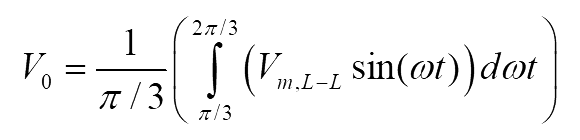

    ..(1)

 

 
Simplifying the above equation
  

  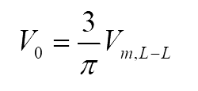
      

    ..(2)

 

 
Average load current is given by

 

  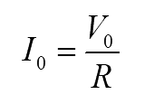
      

    ..(3)

 

 
where,
 

  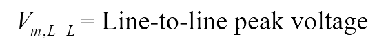
      

    ..(4)

 

 
Each diode conducts for 120&#176;. Hence, the average current through diode can easily be obtained as

 

  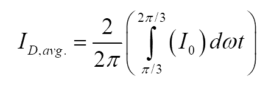
      

    ..(5)

 

 
On simplifying the above equation

 

  
      

    ..(6)

 

 
Similarly, the RMS current through each diode can be given by
 

  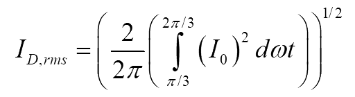
      

    ..(7)

 

 
On simplifying the above equation
 

  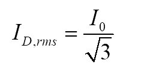
      

    ..(8)

 

 
The RMS source current can easily be obtained as
 

  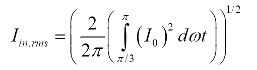
      

    ..(9)

 

 
On simplifying the above equation
 

  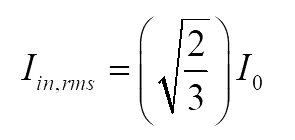
      

    ..(10)

 

 
The RMS value of fundamental current is
 

  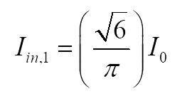
      

    ..(11)

 

 
and the power factor is given by
 

  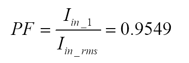
      

    ..(12)

